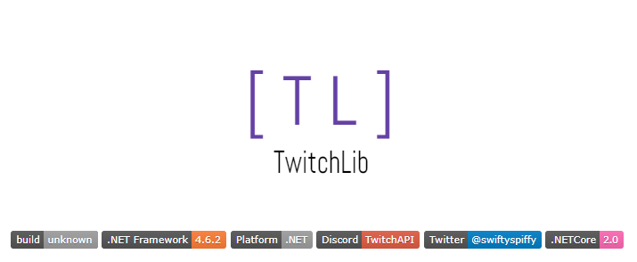

On my [stream](https://www.twitch.tv/1kevgriff), I wanted to play around with building out some tools that help me connect better with my readers and viewers.

> Check out the stream below!

`youtube:https://www.youtube.com/watch?v=ht27gkTCeBQ`

First task on the list was an indicator on *this site* that would tell you if was currently online.  Eventually, this will extend to other tools - but first things first.

Here are the steps I had to follow in order to build my Twitch badge:

1. Create an endpoint that would tell me if I was online
2. Generate a badge that said `online` or `offline`
3. Display the badge on my site

## TwitchLib
When creating an endpoint that would tell me if I was online, I wanted to start with a solid base.  Turns out there is already an amazing open source library called TwitchLib which helps facilitate the connection to the Twitch APIs.



There is a great set of APIs available, and the exact method call I wanted was in the examples: `BroadcasterOnlineAsync`.

```csharp
var user = await _api.V5.Users.GetUserByNameAsync(channelName);
var isOnline = await _api.V5.Streams.BroadcasterOnlineAsync(user.Matches.First().Id);
```

Turns out, I had to take an additional step of getting my channel `ID` instead of just using my channel name.  If anyone knows another way of doing this that's easier/faster/better, please let me know.

## Azure Functions
With my new ability to get channel status at the blink of an eye, I needed a way to query this whenever some came to my site.  

Serverless was the answer.  

I wrote a simple Azure Function for polling Twitch to see if I was online.

```csharp
[FunctionName("IsChannelOnline")]
public static async Task<IActionResult> Run(
    [HttpTrigger(AuthorizationLevel.Function, "get", Route = null)] HttpRequest req)
{
    var clientId = Environment.GetEnvironmentVariable("twitch:clientId");
    var accessToken = Environment.GetEnvironmentVariable("twitch:accessToken");

    var twitch = new Twitch(clientId, accessToken);

    string name = req.Query["channelName"];

    if (string.IsNullOrEmpty(name)) return new BadRequestObjectResult("Channel name was missing.");

    var isOnline = await twitch.IsChannelOnlineAsync(name);

    /* other code */
}
```

This method would let me call a HTTP endpoint, like `https://myazurefunctions.com/api/IsChannelOnline?channelName=1kevgriff` and it would return a response!

> Note: The `await twitch.IsChannelOnlineAsync(name)` is a wrapper around the TwitchLib code I wrote above.  Sorry if that was misleading!

`cta:`

## Shields.io
With my new Azure Function deployed, I need to set up to show if it said online or offline.  

My buddy, [Mike Buckbee](https://twitter.com/mbuckbee), had an amazing idea - why not make it look like build badges used on various GitHub pages.  Another buddy, [Calvin Allen](https://twitter.com/_CalvinAllen), pointed out I could use [Shields.io](https://shields.io/) to build the badge automatically.

To that extent, I could give [Shields.io my Azure Functions endpoint](https://shields.io/endpoint/) and it would build the badge for me.

My updated Azure Function to return the JSON necessary for Shields.io to build a badge.

```csharp
public class ShieldBadge
{
    public int SchemaVersion { get; private set; } = 1;

    /// <summary>
    /// Left Text
    /// </summary>
    public string Label { get; set; }

    /// <summary>
    /// Right Text
    /// </summary>
    public string Message { get; set; }

    /// <summary>
    /// Right Color
    /// </summary>
    public string Color { get; set; }

    /// <summary>
    /// Left Color
    /// 
    /// </summary>
    public string LabelColor { get; set; }

    /// <summary>
    /// Style
    /// 
    /// Options: flat, plastic, flat-square, for-the-badge, social 
    /// </summary>
    public string Style { get; set; }
}

var badge = new ShieldBadge
{
    Label = "twitch.tv/1kevgriff",
    LabelColor = "lightgrey",
    Style = "flat",
    Message = isOnline ? "LIVE" : "OFFLINE",
    Color = isOnline ? "#2f855a" : "red"
};
```

## Adding it to my site
This was the easiest step.  On my site, I added an image tag pointing to the following URL.

```html

```

Doing this will add the awesome little badge you see at the top:


## Wrap up!
This was a fun little project that took me about 2 hours to figure out, start to finish.  Full source code is available at [https://github.com/1kevgriff/Griffin.TwitchBot](https://github.com/1kevgriff/Griffin.TwitchBot)..

Thanks for following along, and [follow me on Twitch](https://www.twitch.tv/1kevgriff) to see when I go live!