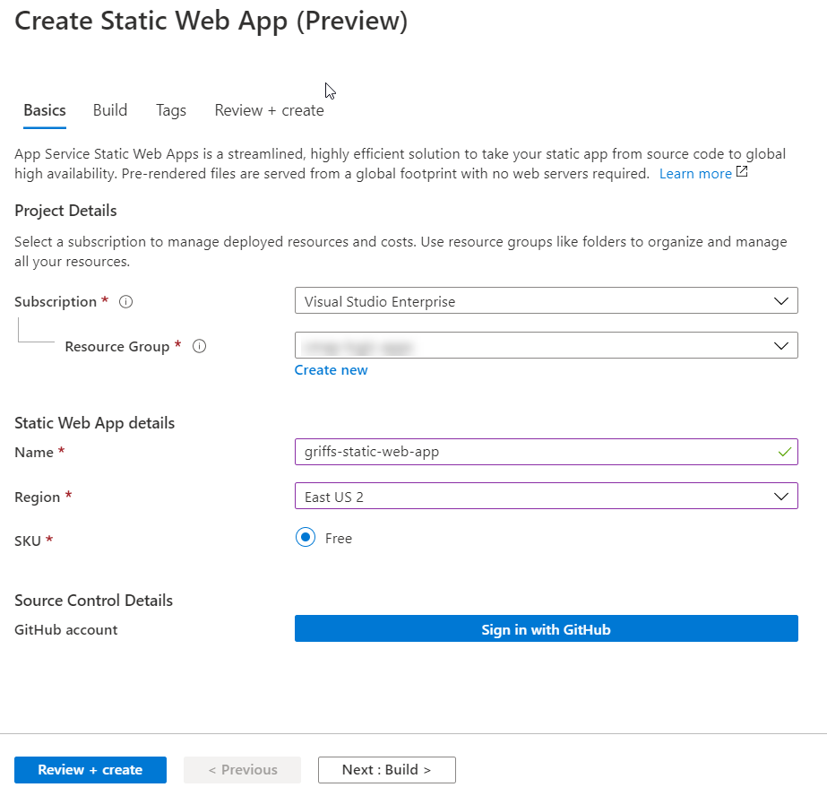
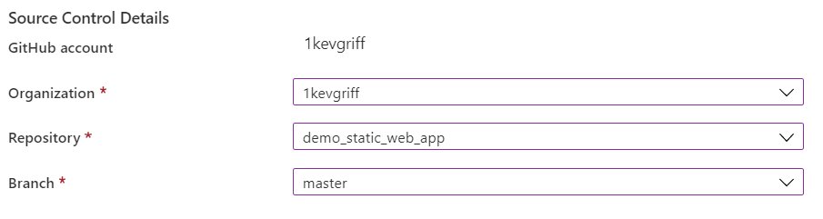
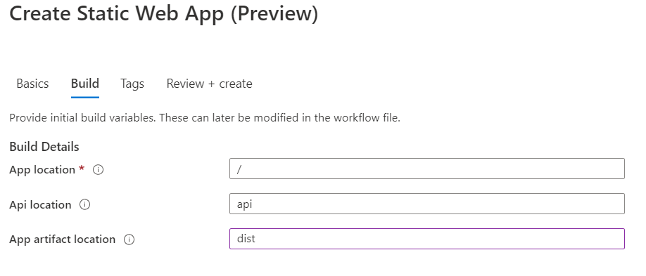
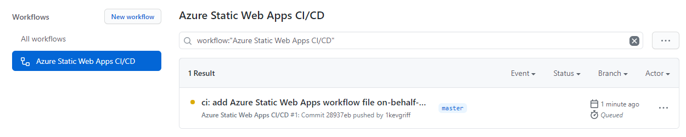
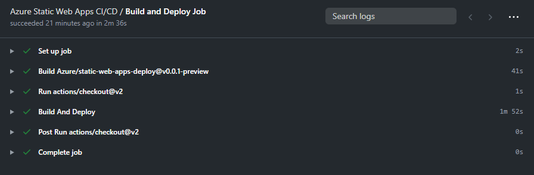
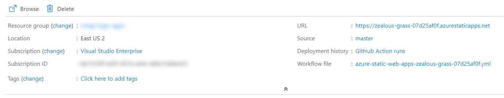

As a web developer, I have fully embraced the idea that to extract pure performance out of our web applications we need to reduce the amount of time that a server needs to churn on request.  Statically generated web sites really scratch that itch.

Take this site for example.  It's statically generated with an amazing tool called Gridsome.  And it's not the only tool in town.  I've successfully used Jekyll, Hugo, Gatsby, and others to build these types of sites.

Why use a static site generator (SSG)?  Again, take my site.  Rarely does the content on this site change.  And that's more of a testament to my need to update it more often, but I digress.  Even if I were publishing articles daily, this site would only update daily.  There is no need to maintain a database or anything like that *cough* Wordpress *cough*.  If you request `consultwithgriff.com/courses`, you should just get a pile of HTML that's sitting on a server somewhere.  Add some caching in front of it (which I do, with Cloudflare) and you have a stupid-fast web site.

So where do you host static web apps?  There are a lot of options available to you.  I've deployed static sites to GitHub Pages.  We used to use Netlify for our old marketing sites.  I've configured Azure Blob Storage to host static content.

Let's talk more about that last option for a moment.  Azure Blob Storage is an amazing solution to this problem, and its use for hosting static web pages was more discovered by accident.  I remember having conversations with friends in 2010 about hosting files this way, and then much later Azure added support directly in the portal to turn this configuration on.

## Sometimes you just need to write code

There is a drawback to static sites.  If you've read [my article on adding reCAPTCHA to my site](/recaptcha-static-sites-azure-functions), you'll see that I had a bit of a problem that needed to be overcome.

In order for reCAPTCHA to work, you need a server-side aspect that can handle the communication with reCAPTCHA servers.  It would defeat the purpose of reCAPTCHA to have that stuff client-side.

How did I solve the problem?

Azure Functions!  I used to be a naysayer of Serverless, but I'll tell you what... Azure Functions really saved my butt here.  One Azure Function later, and I was good to go!

## What if there was a better way?

I liked Azure Blob Storage for hosting my sites, and I liked Azure Functions for hosting my server-side needs.  But that meant I had to maintain TWO separate pieces of architecture.

Recently, Azure released [Static Web Apps](https://azure.microsoft.com/en-us/services/app-service/static?WT.mc_id=DOP-MVP-4029061) which helps to combine all the great parts of static web sites with Azure Functions, in one easy to use package! 

`cta:`

## What's the process of deploying to Azure Static Web Apps?  

### Setting up the Instance

There is one small drawback to Static Web Apps.  You have to store your code in GitHub, but odds are you do that anyway.  You have to store code in GitHub BECAUSE Azure Static Web Apps uses GitHub Actions to perform the build and deployment tasks that make all this tick.

Once GitHub is connected, and you've configured the repository and branch that Azure Static Apps should use, you'll need to tell Azure where the apps live in your repo.

You need to set three paths.

**App location** is where the application lives.  Think of it as your working directory where `npm run build` or similar will be executed.

**Api location** is where the Azure Functions live. 

> Oh snap.  STOP THE PRESSES.  Currently, Azure Static Web Apps only supports JAVASCRIPT based Azure Functions.  I learned this the hard way.  

**App artifact location** is where the distribution files live after the build is completed.  Typically this might be the `dist` folder or `build` folder.  

### Process the Build

After Azure Static Web Apps creates the YAML file for the GitHub Actions, it'll kick off an initial build of the workflow.

### Profit

When your build completes, it'll automatically deploy to a Static App on Azure.  These sites are accessible via randomly generated URLs.

> At the moment, I don't see a way to override the URL.  I'm assuming this is a preview thing and will be corrected when everything goes GA.

## Other Killer Feature: Pull Request Testing Sites

While converting my blog over to Azure Static Web Apps, I created a new pull request to test a couple changes.

To my amazement, a GitHub Action kicked off and it created a test site for me to view my changes.  This is awesome.

After merging the pull request or deleting the pull request, the test site will go away.  I love actions that clean up after themselves!

> Another note: you can only have one test site at a time.  If you open another pull request, it will fail to deploy.

## Conclusions

Overall, I'm in love with Azure Static Web Apps.  The first time I played with it on my [Twitch stream](https://www.twitch.tv/1kevgriff), I had a couple issues with configuration.  But a couple weeks later, when I tried another repo, it worked perfectly the first time!

While Azure Static Web Apps is in preview, give it a try!  Build a simple Gridsome or Gatsby site.  I'm sure you'll love it too!

Have experiences or questions?  Leave a comment below!