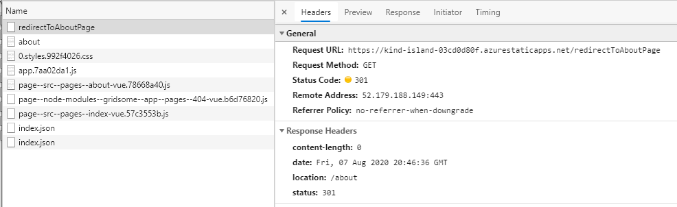

> Updated 2021-06-03: Now that Azure Static Web Apps is GA, 

> TLDR; Look at the [source code](https://github.com/1kevgriff/azure-static-web-apps-routing)

While on [stream](https://www.twitch.tv/1kevgriff) one afternoon, I was working on a solution for moving a Wordpress site to Gridsome, with the goal of deploying to Azure Static Web Apps.  However, I hit a wall that I needed to overcome.

Gridsome URLs take a format like `https://consultwithgriff.com/{something}` and the `{something}` points directly to a folder on the filesystem.  That is how all the URLs in the system work.

I needed to build a URL that had an extensions, like `https://consultwithgriff.com/{something}` but returned a content type of XML.  If I were to have an extensions of `.xml` this would've worked fine.  

So I needed to figure out how to redirect from `{something}` to `{something}.xml` which existed in my static content folder.

And with it being a static web app, there is no server component for me to add a redirection too. So....

## How do you do redirects in Azure Static Web Apps?

Turns out, the awesome team behind Azure Static Web Apps thought about this and built a mechanism for doing server-side redirects.

To get started, you'll want to create a new file called `staticwebapp.config.json`.  This file needs to exist AT PUBLISH time in the root of your build directory.

> In other words, if you commit your changes to GitHub and Azure Static Web Apps kicks in.  It'll start the appropriate GitHub Action to build your app.  At the end of the process, your "build" directory (or "dist" or whatever) will be copied off of disk into Azure.  Make sure `routes.json` is sitting in that build directory at the end of the process.  In Gridsome, this is done via the "static" directory which copies everything into the build directory at the end of the process.  Most other static site generators have a process for this too. 

```json
{
    "routes": [
        {
            "route": "/routeTypedIntoBrowser",
            "redirect": "/redirectToMe",
            "statusCode": 301
        }
    ]
}
```

The `staticwebapp.config.json` does a lot more than just redirects, but for today let's just look at the `routes` section.  Notice it's an array of objects.  If you want to set up a redirect, create an entry with the "route" that someone would type into the browser, and then Azure Static Web Apps will "serve" up the url or path you define.  Lastly, make sure your status code is 301 or 302 so the browser (or HTTP client) can take appropriate action.

[Check out the reference](https://docs.microsoft.com/en-us/azure/static-web-apps/configuration)


## Let's see it in action

I currently have a [Sample Application](https://github.com/1kevgriff/azure-static-web-apps-routing) running in Azure Static Web Apps.  It is currently deployed to [https://kind-island-03cd0d80f.azurestaticapps.net/](https://kind-island-03cd0d80f.azurestaticapps.net).



Try this:

Go to [https://kind-island-03cd0d80f.azurestaticapps.net/redirectToAboutPage](https://kind-island-03cd0d80f.azurestaticapps.net/redirectToAboutPage) and it *should* redirect you automatically to the default Gridsome about page.

It's that simple!

Let me know your thoughts below.  If you have questions that aren't answered by this article, please let me know those as well.
