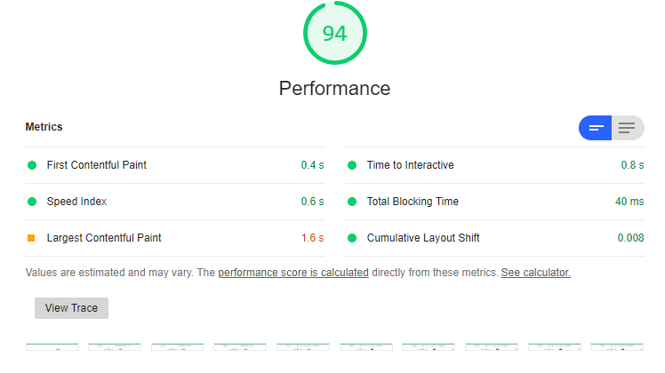
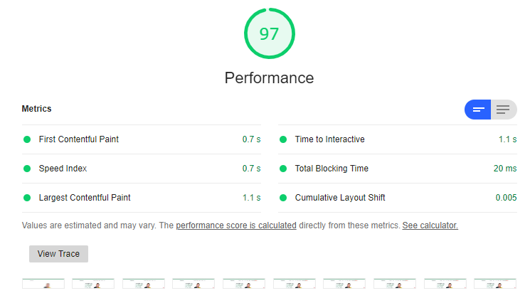

>This article is part of [#ServerlessSeptember](https://aka.ms/ServerlessSeptember2020). You'll find other helpful articles, detailed tutorials, and videos in this all-things-Serverless content collection. New articles from community members and cloud advocates are published every week from Monday to Thursday through September.  
>  
>Find out more about how Microsoft Azure enables your Serverless functions at [https://docs.microsoft.com/azure/azure-functions/](https://docs.microsoft.com/azure/azure-functions/?WT.mc_id=servsept20-devto-cxaall).  

A couple weeks ago, I wrote a [post](/i-love-azure-static-web-apps/) that went semi-viral on social media.  It was essentially a love letter to Azure Static Web Apps, and why I thought you should look at it.

Today, I want to take more about the theory of web performance and why I think Azure Static Web Apps are the best way for us to achieve a lot of wins.

## Static Sites Are Dumb Performant

As soon as you've started the conversation of "which back-end framework shall I use", you've already added an impendence to the performance of your application.

Don't get me wrong.  Back-end frameworks are crazy fast at delivering plain text.  Check out [these benchmarks from TechEmpower](https://www.techempower.com/benchmarks/#section=data-r19&hw=ph&test=plaintext).  Oh hai ASP.NET Core up there at the top. *Wink wink*

But let's be honest, there nothing faster than pulling a raw HTML file off of disk and serving it up over the internet.  Nothing gets in the way.

Let's take that a step further, add a CDN (Content Delivery Network) in front of the web server and a cache.  

This site (consultwithgriff.com) is a static site built with Gridsome.  I host it in two locations for testing purposes.  

The main one is currently running on Azure Blob Storage, and it's sitting in front of Cloudflare for CDN and Caching. 

The second instance is on Azure Static Web Apps, and nothing else.

I've done PageSpeed testing on both sites

**Azure Blob Storage with CloudFlare**  

**Azure Static Web Apps**  

The differences between them are TINY.

## So what's the argument for Azure Static Web Apps?

Not all static apps are created equally.  Sometime it's easy enough to just put out static content.  

But a lot of the "static" web apps I've built in my life have little nuances of "non-static" data.  

Here's a real life example.  At the bottom of the screen you might see the icon for reCAPTCHA.  It's that silly thing that makes you select all the bicycles and then wonder, is that a bike or is that a mailbox... I DON'T KNOW.

I use reCAPTCHA for the mailing list opt-in on the page...  which by the way:

`cta:`

Okay.  reCAPTCHA requires a server aspect in order to work successfully.  When you press "submit" on opt-in form, reCAPTCHA gives me a token.  I need to validate that token in order to submit the request to my mailing list provider.  That validation needs to be in a trusted location, and while you're a perfectly nice person, the browser is not a trusted location.

So how do you solve this problem?

**Serverless!**  Azure Functions to be more exact.

I wrote a simple Azure Function that takes the reCAPTCHA key, validates it, and then submits the request to my mailing list if everything checks out.

You might have other use cases as well.  A "static web app" might be a data-fed Vue.JS or React web application that serves up the framework for the applicaiton but it needs to hit an API for the actual data.  I use the term "static" loosely for this case.

But Azure Functions still serves a purpose here.  My goal is to not own infrastructure.  Running an ASP.NET Core web server, even for API requests is probably more than I want to maintain.

There is one fundemental issue though.  My app is in "blob storage" and my serverless methods are in an Azure Functions app somewhere else.  I'm maintaining two applications.

## Azure Static Web Apps 

What if we could combine both our static web application that would be in blob storage WITH our Azure Functions?  And what if we could put these behind the Azure CDN?  And what if we could have automated deployments from GitHub?

***💥 boom 💥***

Azure Static Web Apps does all of that for you.  I've written, in detail, the process for building and deploying a static web app over in [this post](/i-love-azure-static-web-apps/).  I invite you to give it a read as well.

## Frequently Asked Questions

I get a lot of questions about Azure Static Web Apps, so I thought I'd answer them here:

### Do I need to use GitHub Action?  What about Azure DevOps?

Azure Static Web Apps uses GitHub and GitHub Actions for all of its heavy lifting.  Many folks I've talked to use Azure DevOps or other systems.  My understanding from the team is that these are currently in progress, and I do not have a timeline for when (or if) they'll be implemented.

### What language of Azure Functions can I use?

At the moment, Azure Static Web Apps that employ Azure Functions for API functionality have to be built with JavaScript.  🤯  I know, right?! But I'm told that C# and other language support are on their way.

### How do I handle redirects for SEO?

This is one thing you couldn't do with blob storage!  Azure Static Web Apps has a small routing engine built into it!  [I wrote a post on that too](/how-to-redirect-with-azure-static-web-apps/).

### What about Authentication?

Turns out, you can set up authentication for your web app easily!  Azure Static Web Apps supports:  

* Azure Active Directory  
* GitHub  
* Facebook  
* Google  
* Twitter  

You can use the routing engine to protect routes or allow anonymous requests!

For more details, go to [the docs](https://docs.microsoft.com/en-us/azure/static-web-apps/authentication-authorization?WT.mc_id=DOP-MVP-4029061)

## Conclusions

Azure Static Web Apps is a really exciting move forward for those of us trying to write the most performant web applications we can.  I hope you give it a try, and let me know your thoughts.

Special thanks to the folks at [#ServerlessSeptember](https://aka.ms/ServerlessSeptember2020) for letting me be a part of the fun!
