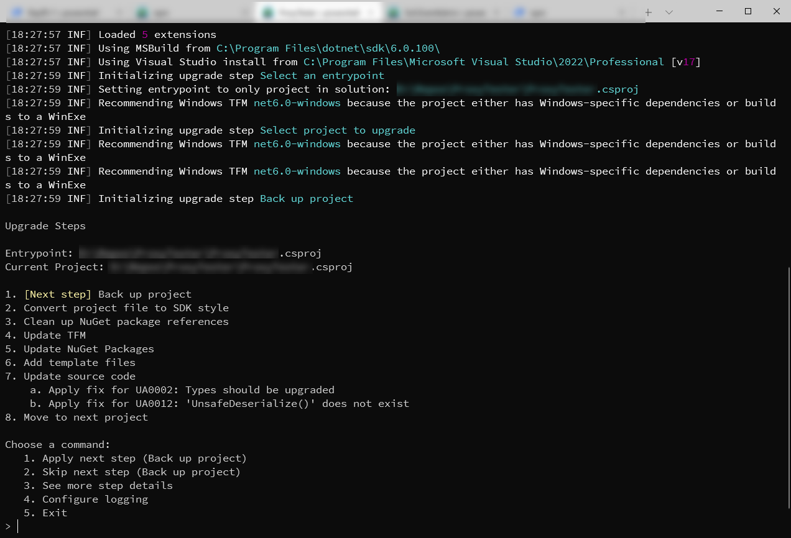

> This is my yearly submission for [CS Advent 2021](https://www.csadvent.christmas)!  Please take a moment to check out all the other great submissions from folks in the community.

## Quick history

Let's rewind back a couple weeks.  I was maintaining a .NET Core 3.1 Web Application.  This particular app had been on quite the journey!  It started life in .NET Framework 4.6 (after I dabbled with the idea of writing the app in node.js, whew I dodged a bullet with that one).  Eventually, it was migrated to .NET Core 1.1.  Then .NET Core 2.2. And then .NET Core 3.1 where it's been since about two weeks ago.

I had skipped the jump to .NET 5 partially out of laziness, but also out of concern.  This application had grown a bit in complexity and moving pieces, so I was wary to put the effort into upgrading it to the latest bits.  And .NET Core 3.1 was the LTS (long term service) version of .NET, so I wasn't in a huge hurry to move forward.

## .NET 6 Launch

I knew that I wanted to move this application to .NET 6, as it would be the new LTS version, and I was foregoing several dependency updates.  In particular, there was one dependency that was still based on .NET Framework that was giving me concern.  It never made the jump to .NET Standard, so I worried about future compatibility.  

It was during the amazing Visual Studio 2021 launch video, I saw mention of the [dotnet upgrade assistant](https://dotnet.microsoft.com/platform/upgrade-assistant).  Now - I feel like a fool because this tool has been around for a while, but it was getting an update to support .NET 6.

Maybe this was the tool that would help us go live with .NET 6?

`cta: `

## Getting Started with Upgrade Assistant

All tools should be as straight forward to install as the .NET Upgrade Assistant.  We'll assume you already have the .NET 6 SDK and Runtimes installed on your machine.  

```bash
dotnet tool install -g upgrade-assistant
```

After a moment, you'll have all the tools and a new command `upgrade-assistant`.

### Analysis

If you run the command `upgrade-assistant analyze [.sln or .csproj]`, you will be provided with a guided path of what an upgrade would look like.

This involves a couple things:

* What TFM (Target Framework) should be used for the project?
* Do any of the project's dependencies need to be updated?
* Are there significant code changes that need to be made to support the upgrade?
* And more!

For my .NET 3.1 project, there were a couple small changes to some of my ASP.NET Core Controllers - but there wasn't a significant code change.

I had another test project that I had taken from .NET Framework 4.6 to .NET Core 6.  This one was a concern, because things such as ASP.NET Identity had radically changed.  You could not do the upgrade without breaking the code.

In all of these cases, the upgrade assistant will tell you what needs to be done and make as many changes it can.

### Upgrade

If you do the analysis step, then the upgrade is basically the same thing except you're provided an option to skip the step or perform the action.

For example, the first step is to Backup all of the projects and code being worked on.  Since I do all of my work in Git branches, I skipped this step because source control.  I recommend you do the same.

There is also an option to provide more detail on each step.  If you're not sure if the step will be expensive or cause a break your code, the upgrade assistant will tell you.



## Go live time!  

Here was the funny part - my upgrade process compiled perfectly the first time.

And that's scary.

We went through the proper motions for testing, and everything worked great.  The application was a bit faster, and the memory usage decreased.

I was really not looking forward to upgrading the project, but the upgrade assistant made it a breeze! 

# Questions Answered

## Does this handle solutions or just single projects?

When I ran the upgrade assistant against my primary project (with ~20 projects in it), the upgrade assistant asked for to designate the entrypoint for the application.

From there, the upgrade assistant looked at all the dependencies, their dependencies, and graphed the best way to tackle the upgrade.

I ended up repeating this process two more times because I had additional entrypoints for the solution (MVC application, an Azure Functions application, and a console service application).

## What .NET langages does the Upgrade Assistant support?

C# and Visual Basic are fully supported!

## What else can Upgrade Assistant help with?

I haven't played around with all of the configurations that the .NET Upgrade Assistant can help you with, but according to the website, the Upgrade Assistant can help with the following project types:

* ASP.NET MVC
* Windows Forms
* Windows Presentation Foundation (WPF)
* Console applications
* Class Libraries

## What about other types of projects?

You'll probably notice ASP.NET Web Forms is missing from the above list, and that's on the [roadmap](https://github.com/dotnet/upgrade-assistant/blob/main/docs/roadmap.md) for the project along with many other features!

## Conclusion

I wasn't looking forward to the upgrade path for my applications, mainly because I didn't want to have to edit all the project files and deal with incremental issues that might have popped up.

The .NET Upgrade Assistant was an amazing tool that helped us get our application into production with .NET 6 easily and quickly.  I'm hoping if you're on the fence about making the upgrade, take the time to check out this tool!
