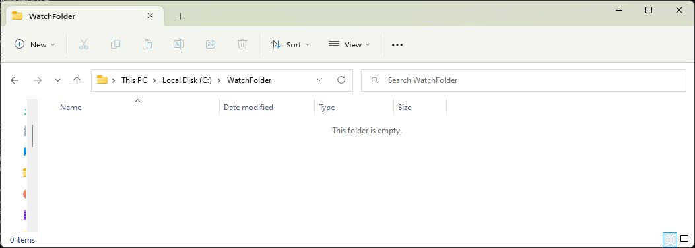
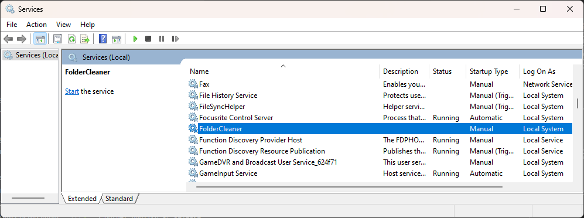
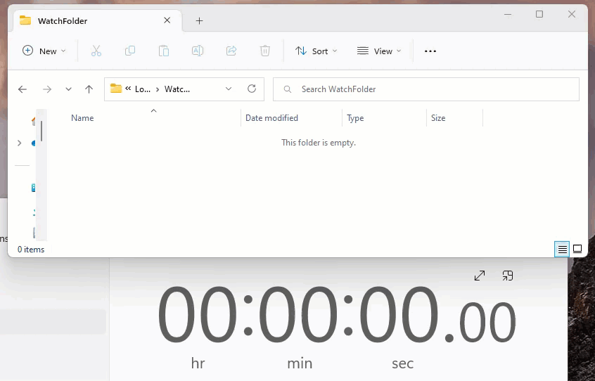

> This article is my entry to C# Advent 2022 and .NET Advent. Please visit [C# Advent](https://www.csadvent.christmas/) and [.NET Advent](https://dotnet.christmas) to see all the other great articles!

In preparation for my latest talk on **Tactics for Building Background Services in .NET**, I've been working on a sample project to demonstrate the concepts.

> Just want the source code example? No problem! All source code for this project available in [Github](https://github.com/1kevgriff/WindowsServiceDotNetExample).

The last time I built a Windows Service was as the CTO of [Winsitter](https://www.bretfisher.com/winsitter/). Winsitter was a service that would monitor your Windows Server and notify you in we noticed anything weird happening. It was a lot of fun to work on, and I wish it was still around today.

> The official Winsitter website went away a long time ago, so I linked to my buddy Bret Fisher's article about it.

Winsitter used a Windows Service to gather metrics about the server it was running on. We'd communicate these metrics to a service we hosted in Azure, where we'd analyze the data and send notifications to the user.

Creating Windows Services was a lot of work back then, and it was one of those processes you spent days perfecting, and then NEVER TOUCHED AGAIN. It becomes lost knowledge immediately after you're done.

## Why do we still care about WindowsServices?

You'd imagine that everything today was moving to the cloud, so Windows Services should be a thing of the past? Well, not really. There are still plenty of reasons to build a Windows Service.

For most, you might be currently sitting at a Windows machine. If you're not, move on. But if you are, that Windows machine has native applications. Behind the scenes, there is probably an associated Windows Service.

Windows Services are beneficial, as they run in the background and they're automatically managed by Windows. You don't have to worry about them crashing or restarting them; they just run.

## Bootstrapping a Windows Service Project

From your terminal, run the following command to create a new project:

```bash
> dotnet new worker -o WindowsService
```

This will create a new project with the following structure:

```bash
.
├── WindowsService.csproj
├── Program.cs
└── Worker.cs
```

Inside of the Program.cs, you'll see the following code:

```CSharp
using WindowsService;

IHost host = Host.CreateDefaultBuilder(args)
    .ConfigureServices(services =>
    {
        services.AddHostedService<Worker>();
    })
    .Build();

host.Run();
```

This isn't a "Windows Service" yet, but it's a good start. We will need to make a few changes to this code to make it a Windows Service.

## Making it a Windows Service
Back at the terminal, install the appropriate NuGet package for Window Services:

```bash
> dotnet add package Microsoft.Extensions.Hosting.WindowsServices
```

Update the Program.cs to look like the following:

```CSharp
using WindowsService;

IHost host = Host.CreateDefaultBuilder(args)
    .UseWindowsService(config =>
    {
        config.ServiceName = "Folder Cleaner Service";
    })
    .ConfigureServices(services =>
    {
        services.AddHostedService<Worker>();
    })
    .Build();

host.Run();
```

The method **UseWindowsService** will take care of all the configuration for you within Windows.

If you never had to build a Windows Service in the .NET Framework days, you cannot understand how amazing that is. We used to have libraries to help do all the stuff that **UseWindowsService** does for us.  🤯

## Introduction to .NET Hosted Services
As impressive as **UseWindowsService** is, it's essential to understand what's happening behind the scenes.

Let's quickly talk about [.NET Hosted Services](https://learn.microsoft.com/en-us/aspnet/core/fundamentals/host/hosted-services?WT.mc_id=DOP-MVP-4029061).  

This was a cool little feature added to .NET Core 2.1. It allows you to run code in the background without having to worry about the details of how it's running. Not only that, but you can manage and inject dependencies just like ASP.NET Core applications.  

Open up Workers.cs, and you'll see the following code:

```CSharp
namespace WindowsService;

public class Worker : BackgroundService
{
    private readonly ILogger<Worker> _logger;

    public Worker(ILogger<Worker> logger)
    {
        _logger = logger;
    }

    protected override async Task ExecuteAsync(CancellationToken stoppingToken)
    {
        while (!stoppingToken.IsCancellationRequested)
        {
            _logger.LogInformation("Worker running at: {time}", DateTimeOffset.Now);
            await Task.Delay(1000, stoppingToken);
        }
    }
}
```

This is a simple implementation of a Hosted Service. It's a **BackgroundService** that will run in the background and log a message every second.

> Note: you can also build a service with IHostedService, but BackgroundService is easier to work with.

## Building the Folder Cleaning Example
The simple example we'd like to build is an application that monitors a folder for new files. If we see any file older than one minute, delete it.

Here is the code for our new Worker.cs looks like this:

```CSharp
public class Worker : BackgroundService
{
    private readonly ILogger<Worker> _logger;

    private const string FolderToWatch = @"C:\WatchFolder";
    private const int DelayInMilliseconds = 10000;

    public Worker(ILogger<Worker> logger)
    {
        // we could (and should) inject configuration here
        _logger = logger;
    }

    protected override async Task ExecuteAsync(CancellationToken stoppingToken)
    {
        // create FolderToWatch if it doesn't exist
        if (!Directory.Exists(FolderToWatch)) Directory.CreateDirectory(FolderToWatch);

        while (!stoppingToken.IsCancellationRequested)
        {
            // check FolderToWatch for files
            var files = Directory.GetFiles(FolderToWatch);

            // delete any file older than 1 minute
            foreach (var file in files)
            {
                var fileInfo = new FileInfo(file);
                if (fileInfo.CreationTime < DateTime.Now.AddMinutes(-1))
                {
                    _logger.LogInformation($"Deleting {fileInfo.Name}");
                    fileInfo.Delete();
                }
            }

            await Task.Delay(DelayInMilliseconds, stoppingToken);
        }
    }
}
```

## Testing Locally
Ideally, you want to support a local development experience. This is pretty easy! Add the terminal, type:

```bash
> dotnet run
```

This will start the application and create our watch folder.

```
Building...
info: Microsoft.Hosting.Lifetime[0]
      Application started. Press Ctrl+C to shut down.
info: Microsoft.Hosting.Lifetime[0]
      Hosting environment: Development
info: Microsoft.Hosting.Lifetime[0]
      Content root path: D:\Repos\WindowsService
```



Drop a new file into the folder (the one you don't mind losing because it'll be deleted).  


```
info: WindowsService.Worker[0]
      Deleting New Microsoft Word Document.docx
```

## Creating / Deploying the Windows Services

Okay! We're ready to test our new application as a Windows Service. You'll need to build a production version of the service.

```bash
> dotnet publish -c Release 
```

Next, you'll need to open a command prompt as an Administrator. We will issue a Windows command to create the new windows service.

```bash
> sc create FolderCleaner binPath= "D:\Repos\WindowsService\bin\Release\net7.0\publish\WindowsService.exe"

[SC] CreateService SUCCESS
```

> Note: your binPath might be different than mine.  

You can open your **Services** view in Windows to see a new service.



Right-click on the new service, and select **Start**. Its status should change to **Running**.

Go back to your watch folder, and drop a new file in. It should be deleted after a minute.



## Cleaning up

You probably don't want to keep your test service around, so go ahead and stop it. Then issue the following command to remove it:

```bash
> sc delete FolderCleaner
```

And that's it! You've created your first Windows Service with .NET 7.  🎉

All source code for this project available in [Github](https://github.com/1kevgriff/WindowsServiceDotNetExample).

I hope this tutorial has been helpful to you! If it has, please reach out to me on [Twitter](https://twitter.com/1kevgriff) or [Mastodon](https://bbiz.io/@1kevgriff). I'd love to hear from you!


