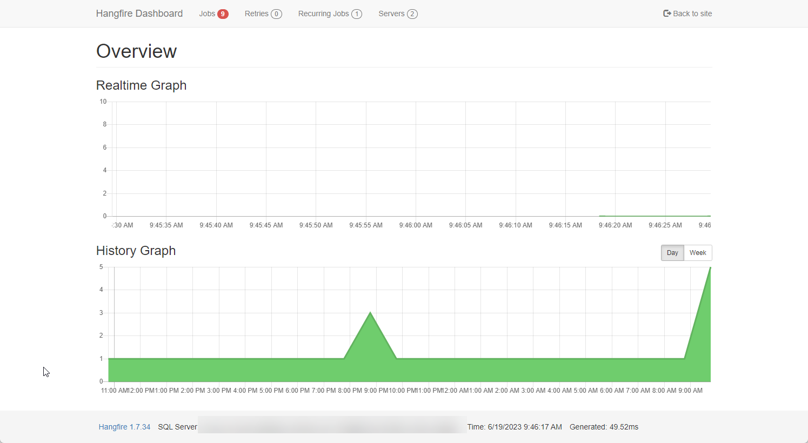
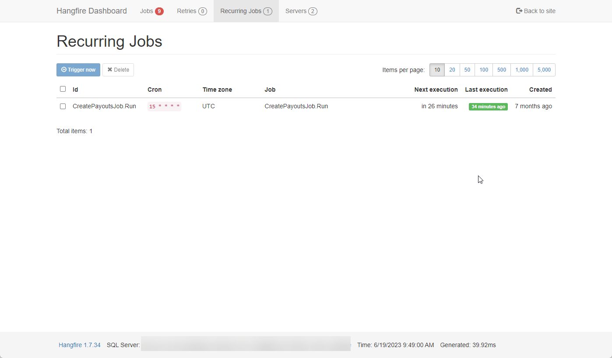
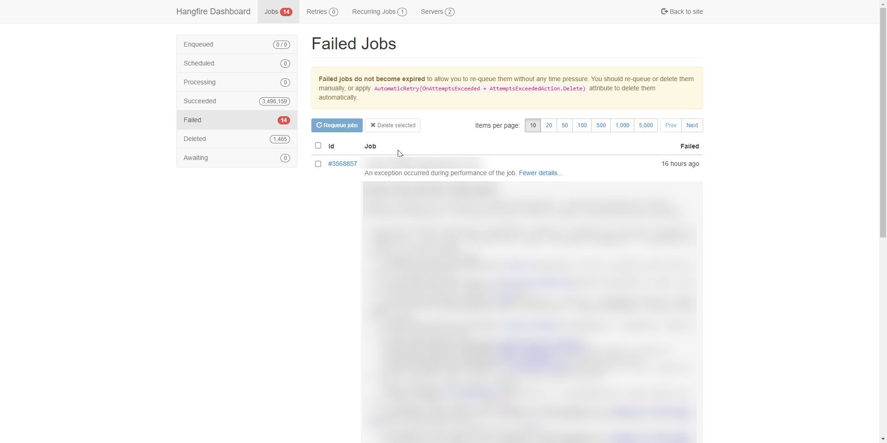

I've been doing a talk on the speaking circuit called **Tactics for Building Background Services in .NET**, and it's doing really well.  Want to check it out?  Here is a link to the video from my visit to NDC London:

`youtube:https://youtu.be/48cdGLIvYAM`  

One of the tools that stands out most of all in the talk is HangFire.  I've been using HangFire for years, and it's been a vital tool for offloading some of the heavy lifting from my web applications.  I want to talk about a couple of the reasons why I love HangFire, and why you might want to consider it for your projects if you're not already using it.

## 1. It's Easy to Setup  

Adding HangFire to your .NET applications is really straight forward, install the NuGet package and write a little bit of configuration code.

```csharp
using Hangfire;

var builder = WebApplication.CreateBuilder(args);

// configure logging to console
builder.Logging.AddConsole();

builder.Services.AddHangfire(config =>
{
    // use DefaultConnection connection string
    var connectionString = builder.Configuration.GetConnectionString("DefaultConnection");
    config.UseSqlServerStorage(connectionString);
});

builder.Services.AddHangfireServer();

var app = builder.Build();

app.MapGet("/", () => "Hello World!");

app.Run();
```

Granted, that's not all the code you need if you want more advanced features like the user interface, recurring jobs, etc.  But this is enough code to do the basics and HangFire will start working quickly for you!

## 2. Bring Your Own Code

In one of my gripes with other *scheduling* systems is that you have to use their implements.  **IJob** or similar.  While vendor lock isn't a huge issue, wouldn't it be nice if you could just bring your own code to the party?  HangFire allows you to do just that.  You can use any method you want as a background job.  Here's an example:

```csharp
public class WebPuller
{
    private readonly ILogger<WebPuller> _logger;
    private readonly IHttpClientFactory _httpClientFactory;

    public WebPuller(ILogger<WebPuller> logger, IHttpClientFactory httpClientFactory )
    {
        _logger = logger;
        _httpClientFactory = httpClientFactory;
    }

    public async Task GetRssItemUrlsAsync(string rssFeedUrl, string filename)
    {
        // check if filename directory exists
        var directory = Path.GetDirectoryName(filename);
        if (!Directory.Exists(directory)) Directory.CreateDirectory(directory);

        using var client = _httpClientFactory.CreateClient();
        var rssContent = await client.GetStringAsync(rssFeedUrl);

        using var xmlReader = XmlReader.Create(new StringReader(rssContent));
        var feed = SyndicationFeed.Load(xmlReader);

        var rssItemUrls = feed.Items.Select(item => item.Links.FirstOrDefault()?.Uri.AbsoluteUri).ToList();

        var json = JsonSerializer.Serialize(rssItemUrls);
        await File.WriteAllTextAsync(filename, json);
    }
}
```

This class is one I built for my course, and it gets data from an RSS feed and saves it to a file.  What's really great is that I can use this class as a background job in HangFire.  Here's how:

```csharp
app.MapGet("/pull", (IBackgroundJobClient bg) =>
{
    var url = "https://consultwithgriff.com/rss.xml";
    var directory = $"c:\\rss";
    var filename = "consultwithgriff.json";
    var tempPath = Path.Combine(directory, filename);

    var result = bg.Enqueue<WebPuller>(p => p.GetRssItemUrlsAsync(url, tempPath));
});
```

**IBackgroundJobClient** is an injectable that I can use to run background jobs on the fly.  **Enqueue** takes the object type I want to work with, and I can queue up the method I want to run.  In this case, I'm using the **GetRssItemUrlsAsync** method from the **WebPuller** class.  I can also pass in parameters to the method, which is really handy.

HangFire will automatically process this job as it's able.

But no special code or interfaces to implement.  Just bring your own code and you're good to go!

## 3. Easy to Use Dashboard

The dashboard for HangFire is where I get the most oohs and ahhs when demoing the tool.  It's a great way to see what's going on with your background jobs.  Here's what it looks like:



From this dashboard, you can do a lot of work without having to mess with configuration or external data stores.  You can see the jobs that are running, the jobs that have failed, and the jobs that are scheduled to run.  You can also see the history of jobs that have run.  It's a great way to get a quick overview of what's going on with your background jobs.

## 4. Scheduling and Recurring Jobs



Sometimes you need to make sure a job runs at a recurring time.  HangFire makes it easy to create recurring jobs.  Here's an example:

```csharp
var url = "https://consultwithgriff.com/rss.xml";
var directory = $"c:\\rss";
var filename = "consultwithgriff.json";
var tempPath = Path.Combine(directory, filename);

RecurringJob.AddOrUpdate<WebPuller>("pull-rss-feed",
                                    p => p.GetRssItemUrlsAsync(url, tempPath),
                                    "* * * * *");
```

This code will run the **GetRssItemUrlsAsync** method every minute.  You can use [crontab guru](https://crontab.guru/) to help you build the cron expression.  

But you can get as specific as you need to with these expressions.  If you need 9pm every Tuesday, you can do that.  If you need 3am on the first of every month, you can do that too.  It's really flexible.

Scheduled jobs work similar to enqueuing them, but you're providing a time for them to run or a TimeSpan.  Here's an example:

```csharp
client.Schedule<WebPuller>(p => p.DownloadFileFromUrl(url, filePath),
    TimeSpan.FromSeconds(delayInSeconds));
```

This will execute the DownloadFileFromUrl method after the delayInSeconds has passed.  

## 5. Failures and Retries at a Glance

The worst thing about background jobs is when they fail.  It's not always easy to know when they fail, and it's even harder to know why they failed.  HangFire makes it easy to see when jobs fail and why they failed.  Here's an example:



The failed list will provide a list of jobs that have failed.  You can click on the job to see the details of the failure. 

Hangfire *really* wants to make sure your jobs succeed, so it'll automatically retry multiple times to run the job.  You can see the outcome of all these runs, and even enqueue another run if all the previous runs failed.


This view alone has saved me a ton of debugging time because I was able to isolate exactly where my issue was, and what parameters were used to run the job.  

## Get the Course

A few weeks ago, I announced the launch of my new course, **Building Background Services in .NET with HangFire**.  The course aims to teach how to create and manage background jobs using HangFire, a powerful open-source library that can help improve the performance and scalability of .NET applications.  The course covers fundamental concepts of background jobs, setting up and configuring HangFire, creating and managing background jobs using the HangFire dashboard, scheduling recurring jobs, handling errors, and scaling background services.

[](https://www.udemy.com/course/building-background-services-in-net-with-hangfire/?referralCode=ADE705B8BB4A44749A7D)