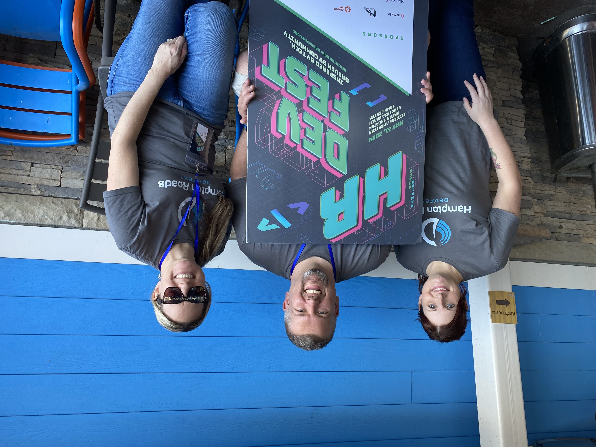
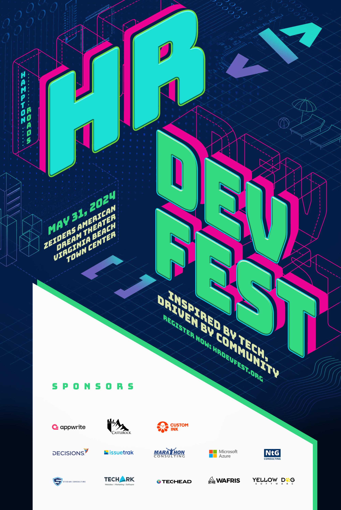

On May 31st, 2024, we held the fifth Hampton Roads DevFest in Virginia Beach, Virginia. DevFest was Southeast Virginia's first significant software development event since before COVID. I'm excited to say it was a massive success.

In this post, I aim to provide a comprehensive event retrospective, offering valuable insights to those interested in the intricacies of running a small-scale software development conference. These insights, gleaned from our experience, can empower you to navigate the challenges and maximize the potential of your own events.

## RevolutionVA

My journey with RevolutionVA began in 2016, and I'm privileged to serve as the President of this 501c3 non-profit. RevolutionVA is not just a platform; it's a community. A community dedicated to fostering software development education in Southeast Virginia, a mission I'm deeply committed to and proud to be a part of.  

Since starting in 2016, we've run four instances of RevolutionConf, our flagship developer conference (2016, 2017, 2018, and 2019), and four other instances of Hampton Roads DevFest (2016, 2017, 2018, 2019). Additionally, we've hosted tech movie nights, where we've paid for rights to documentaries about software development and Nodebots. During this one-day workshop, kids (and adults!) could come to build, decorate, and  BATTLE their own personal robots.

## Getting the Itch (again)

As you're probably aware, in 2020, the world ended. This series of events was catastrophic to the Hampton Roads developer community. Many of the local meetups just faded away. People changed jobs. Some folks left the area, and a new crop moved in!  

My RevolutionVA partner-in-crime, Linda Nichols, and I had coffee in 2023 about the developer community's future in Hampton Roads. 

Meetups were having difficulty rebounding. For demonstration, the Hampton Roads .NET Users Group, which I've run since 2009, would average 30 people per meeting. We'd pack a classroom on a good month. After going back to in-person events post-COVID, we saw closer to 5-7 people per event. Disconcerting, to say the least.

I *really* wanted to do another RevolutionConf. There is a certain level of risk to running any event. Still, RevolutionConf was a scale much more significant than we wanted to take on. We automatically knew potential speakers would be on board. The number of people asking me weekly when we'll do another RevolutionConf is impressive. I understand why; we take fantastic care of our speakers, and the conference is on the beach. It's definitely a destination for many folks.

But it would be best if you had more than speakers to run a conference. You need sponsors and ATTENDEES.  

I've been dancing around the point: we didn't trust the community to show up. 

I feel bad saying that, but I'm unsure how to respond to a potential $75,000 investment when meetups in the area barely pull in a dozen attendees.  

The solution to having doubts like this is to do something smaller, and thankfully, we already had a brand for a more minor, hyper-local event called Hampton Roads DevFest.

> 
> 
> Let it be known, I could not have done DevFest without Linda and Alex. They're awesome members of this community.

## Hampton Roads DevFest

DevFest started before RevolutionConf did, and we always wanted DevFest to focus on the local developer community. Speakers should always be local. It wouldn't be a multitrack event. At most, DevFest would have two concurrent speakers.  

Because we needed to rebuild trust in the community, and more importantly, we wanted to get the word out to the community that we exist, it was time to bring back DevFest.

DevFest was an easy sell. RevolutionVA had about $10,000 left in the bank from the last RevolutionConf. We were confident we could keep costs low; in the worst case, RevolutionVA could fund the event without sponsors.

The playbook is simple: find a venue, book a date, find some speakers, sell some tickets, and get some sponsors.

## Finding a New Venue

I start doing budget work once I have a reasonable idea of WHERE to host the event. Our initial attendee expectation for DevFest was 150 people, and that was being generous.  

The venue plays a huge factor in the costs of an event. Venues fall into one of these categories:

* Low, reasonable cost for the space
* Free, but you have food and beverage minimums
* Low cost, but food and beverage minimums
* Reasonable cost, but still, food and beverage minimums
* Expensive, and food and beverage minimums
* Omg that's the price?  

We were looking for a space that had reasonable cost but was also unique. I'm not too fond of conference centers. They're just dull, and you need to take a lot of steps to make them not seem boring. Codemash and THAT Conference do an excellent job of this. They'll convert a dull conference area into a vibe, and I'm here for it!

I had my eye on two unique venues. First was the [Family Fun Experience Theater](https://www.ffxshow.org) in Virginia Beach, VA. Definitely unique! Typically, this theater is used for improv shows and family theater events. It was also right near the beach!  

It seems exciting that it's near the beach, but it's too far on the outskirts of the area for a hyper-local event. I wanted something more central.

Second was [Zeider's American Dream Theater](https://thez.org) in Virginia Beach, VA. This theater popped up in Virginia Beach Town Center in 2019. Their website has an excellent first-person tour of the facility, showing off this incredible stadium seating theater. They're also a non-profit organization like RevolutionVA. I love it when we're able to support local!

We booked a tour with Zeiders and walked into the "big room." We all got TED-talk vibes, and we knew there wasn't any more looking to be had. We found the location for Hampton Roads DevFest 2024.

## Let's Talk Finances

RevolutionVA is a non-profit.  I'm not in the business of hiding our income or profit/lost information, and it's helpful for aspiring conference organizers to see what something like Hampton Roads DevFest would cost.

Budget is a big topic. In general, I organize a budget in terms of needs.

We need a venue. We need to feed people at least lunch, but we'd also give them coffee and breakfast. 

There are weird costs like insurance, signage, city fees, marketing, etc., that all add up.

I'll talk costs along the way, and we'll summarize everything at the end.

## Venue Pricing

Zeider's pricing is on their website, and it's affordable for what we're getting.

Our total cost for the venue was $4,288. That included using the theater, the lobby area, and a kitchen/green room for storage. The theater included an A/V team to ensure our speakers were properly mic-ed up and sounded terrific.  

Zeider's also did not have food or beverage requirements, nor did they require us to use their vendors for catering. They did provide concessions for us, which I'll talk about a bit more when I get to "game day."

## Speakers

Since Hampton Roads DevFest is hyper-local, we wanted all our speakers to be local. It was vital to the vibe of the conference that we showcased local talent because we have A LOT of it. 

The team and I discussed who we'd like to see speak at the event and personally extended invitations to many folks. But we didn't want to cut ourselves short, so we also set up a Call For Speakers on [Sessionize](https://sessionize.com)

Sessionize typically costs $500 per paying event. If you're a free or community event, Sessionize will waive this cost. Hampton Roads DevFest was in this weird gray area where it's a community event. However, we're still charging admission to attend. Thankfully, the folks at Sessionize gave us a fifty percent discount, bringing our Sessionize costs to $249.

On paper, using Sessionize wasn't the best investment for us. Our talent pool was small, to begin with, so we only got a handful of credible speakers who were able to read the directions. Yes, I'm calling you out, Mr. Person from Brazil, who expected us to pay for your travel to the United States even though we asked for speakers local to the Virginia Beach / Norfolk regional area.

Sessionize brought us one of our best speakers, Omar McNeil, whom we didn't know about! Omar lived close to the area, worked for GitHub, and was an excellent match for the type of person we wanted to have on stage.

Sessionize was also a great way to communicate with speakers leading up to the event. 

In the end, we ended up with a fantastic crew of local Hampton Roads talent to put on display: Monica Rathbun, Travis Webb, Chazona Baum, Michael Buckbee, Jenah Parman, Marla Schuchman, Ken Collins, Omar McNeil, and Guillermo Fisher.  

> Quick aside: diversity is essential. Too many conferences try to get away with, "Oh, we accidentally booked a slate of white dudes."  Thankfully, for Hampton Roads DevFest, I would've had to actively try to get nothing but white dudes. Our community is already diverse, and the speaker list reflects that.

## Food

Early in my career, I was a frequent speaker at a series of events called "Code Camps." This still exists today in various forms, but there were a couple key tenants. One of the things we'll do is make sure you get fed.

With DevFest, we knew we needed to provide coffee and some subsidence to convince people to be there early for the first sessions.

Zeider's had no requirements of us for vendors, so we opted to do a catering order with the local Wegman's grocery store. They'd provide all our coffee, juices, bagels, breads, and sweets. 

For lunch, we were basic. Next door to our venue was TASTE, an excellent sandwich chain. They have a full catering menu, and we opted for various box lunches that included a sandwich, chips, and a cookie. There were offerings for our gluten-free and veggie friends, too.

In hindsight, we didn't have a good offering for vegan attendees. I had assumed we had all the bases covered regarding dietary restrictions. There was one person we couldn't provide for, and I apologize for that.

Along with box lunches, everyone got a bottle of water. I know, it's boring. But cheap!

We made a deal with Zeider's to provide all attendees with two drink tickets. These tickets would be good at the concession stand, and proceeds went to help fund the programs they did at Zeider's. Attendees could choose from soft drinks, coffee, tea, and assorted beer and liquor. We considered this a reasonable alternative to providing a variety of drinks at lunch. Everyone wins!

We paid $4,272 for all our food during the event.

## Happy Hour

It's exhausting running and attending an event like Hampton Roads DevFest, and we wanted to provide a relaxing happy hour for all the attendees, speakers, and sponsors. 

Happy Hour falls under the category "we'll only do it if we can find someone to pay for it." It's definitely a non-critical item on our list.

We initially listed the cost of the Happy Hour as a sponsor item for $2,000. And we had a sponsor, Stigian Consulting, take us up on the offer. They've supported us, and we're happy to have them back.

Our mistake was we needed to correctly spec out Happy Hour costs. We wanted the Happy Hour close to the event venue or feared losing most attendees. However, the initial estimated cost was $3,500 to $4,500. 

We were prepared to eat the additional costs. Thankfully, some fancy talking from Alex, one of our organizers, got us an "appetizers and drinks" option where I'd just pay the bill. No buffet, just food at "happy hour" prices. We saved a ton.

We paid $1,903 for the Happy Hour appetizers and drinks, just shy of the $2,000 sponsorship we received!

## Ticket Costs

Pricing tickets for an event like Hampton Roads DevFest is an exercise. We want to be accessible to everyone: professionals, students, etc. But we also need to cover some of the costs of having the attendee there.

We settled on two tiers of tickets. Early bird tickets would be $25 each and would be available until we had our speakers announced. I like this process of "make a bet on us and we'll give you a discount." 

Full tickets were $50 each and ran from when we announced the speakers.

Many tickets came in the last 72 hours before the event, to the extent that I was worried about the amount of food we would have available. Thankfully, our catering allowed for last-minute changes, but it affected the overall bill. Not to mention it's really inconvenient for us to make changes like this.

I made a play. I closed the ticket sales but opened a "Last Minute" ticket for $100. I'm fine if you want to wait until the last minute to buy a ticket, but sorry, you need to pay for it. This ticket brought in a couple hundred extra dollars. Great decision.

In hindsight, $50 should have been the base price. It's still crazy cheap for what we provided in return, but I was more focused on "butts in seats" than profit.

We also bookmarked an epic ton of tickets for giveaways. [757ColorCoded](https://757colorcoded.org) received many of these, and the community turned out! I love this group and am so happy to see them come out in droves.

I earmarked 150 tickets for local education, Colleges and Universities. I emailed every professor or administrator I could find, encouraging them to give my tickets away. Three were redeemed. ONE TWO THREE. This isn't new. Historically, we haven't been able to give away tickets to education, and I will stop trying.

Ticket sales accounted for $4,432, about 34% of our income.

## Sponsors

It's no lie that so many of these events hinge heavily on sponsors, and we were lucky to have so many partners willing to chip in.

Most conferences will have a variety of tiers that offer increasing levels of "things" that the sponsor will get in return. That's a fine idea, but we wanted to take a different approach with Hampton Roads DevFest. Namely, we only had a few things to offer as tiers. I'd want sponsors to show up and be awesome, or I want them to just give us money.

We settled on two tiers. First was the "show up and be a vendor" sponsorship. It included a table, nice words on social media, and a handful of tickets to the event. We priced it at $750. In hindsight, this should have been $1,000 to $1,500. However, I underestimated the attendees we would get, so the perceived value seemed lower.

The other sponsorship we offered was a "logo only" sponsor, which would put you on the website. I'd also say nice things about you on social media. This was $250. 

What I like about the logo sponsorship is that it is an excellent way for smaller companies to toss us money without a big commitment. Sadly, this was the go-to sponsorship for some companies that could have paid more. But I'd always rather get something than nothing.

We collected $8,250 in sponsorship. 

Fun story: Microsoft was one of our sponsors, and we were required to go through a lengthy vendor process to get paid. The icing on the cake was they gave themselves a discount for paying NET 14 instead of NET 30.

## Design Work

Our design work was one of the least expensive aspects of Hampton Roads DevFest. There are a variety of signs we needed mocked up. There was the main poster. There are social media signs. There's guidance on not bringing food with the theater. All these signs needed someone other than me with my passing experience with Canva.  

Our designer, Trisha Tobias, was terrific! We took a bunch of our ideas and threw together some mocks.  

We spent $190 on design work, a drop in the bucket. Trisha isn't based in the United States, so she can charge lower rates. I recommend devoting some of your budget to design. It'll pay off in the long run.

## The Unavoidable Extras

If you're running an event, your venue will likely require insurance. Our insurance for one day was $250. The funny thing about insurance is that you'll most likely not use it, but you'll be thankful you had it.

This is the first year the City of Virginia Beach required us to apply for Event Admissions Tax. As a non-profit, we're technically exempt from the tax. However, we still had to go through the motions of applying and paying for the license but not having to pay the tax. This was $51.25 because you also have to pay for the privilege of paying online.

I'm going to lump many expenses together: $1963. This covered some of our printing costs, a limited run of t-shirts, and some software licenses we paid for marketing and mass emails. It's not necessary to itemize these.  

## Total Success

I'm sure I'm well over 10 minutes of reading now, but I want to conclude that Hampton Roads DevFest succeeded. We had 183 registered attendees, far beating my hopes of 150 people and my expectation of ~120 people. This is the most well-attended DevFest we've ever had.

Thank you so much to everyone who turned out, whether you were a speaker, a sponsor, or an attendee. I cannot express how much you've renewed my hope for the region.

## The Final Breakdown

Income: $12,682.31 (between ticket sales and sponsorships)

Expenses: $13,168.94  

===============  
Net Loss of $486.63

That's different from what you were expecting. It is ideal for a conference to have some extra money in the bank; we failed to do that.  

I really hope this breakdown of Hampton Roads DevFest was helpful for you. Running and funding a conference is a lot of work, and DevFest is only a small event. A few weeks ago, I did a podcast episode with Clark Sell where we talked about [The Business of Conferences](https://podcast.multithreadedincome.com/episodes/the-business-of-conferences-multithreaded-income-episode-38-with-clark-sell). Clark is working with a much larger budget than I am, but as Biggie and Puffy said, "mo money mo problems."

I'd love to chat with you about this article. Please find me on Twitter/X as [@1kevgriff](https://x.com/1kevgriff) or [LinkedIn](https://www.linkedin.com/in/1kevgriff).  Thanks for taking this journey with me!  