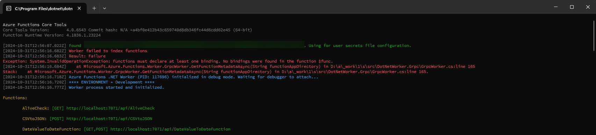

Don't you just hate errors that will tell you something is wrong, but not tell you what?  I ran into that case recently while refactoring an Azure Functions project.  



```cli
Worker failed to index functions
Result: Failure
Exception: System.InvalidOperationException: Functions must declare at least one binding. No bindings were found in the function $func.
at Microsoft.Azure.Functions.Worker.GrpcWorker.GetFunctionMetadataAsync(String functionAppDirectory) 
```

Notice how this error message doesn't tell you which function is missing bindings?  I mean, it really wants too.  See that **$func**?  It's trying to tell you which function is missing bindings, but it's not going to just come out and say it.

What's causing the error? It's because I have a **[Function()]** but no triggers.  

So how do you figure out which function is messed up or missing the bindings?  The trick I used was to search GitHub for the error message I was getting.  That led me to [this line of code](https://github.com/Azure/azure-functions-dotnet-worker/blob/main/sdk/FunctionMetadataLoaderExtension/FunctionMetadataJsonReader.cs#L29).  Generally speaking, the Azure Function host is looking for the **bindings** sections in the function metadata.

The function metadata is generated at compile time, and it's stored in a file named **functions.metadata**.  I found the file in my **bin** folder for the project.  Within moments, I saw the problem.

> Hey there!  If this article was helpful or you have any constructive tidbits to add, please let me know on [X](https://x.com/1kevgriff), [BlueSky](https://bsky.app/profile/consultwithgriff.com), or [LinkedIn](https://www.linkedin.com/in/1kevgriff/).

First, here is an example of a well-defined function:

```json
  {
    "name": "AliveCheck",
    "scriptFile": "{... removed for brevity ...}",
    "entryPoint": "{... removed for brevity ...}",
    "language": "dotnet-isolated",
    "properties": {
      "IsCodeless": false
    },
    "bindings": [
      {
        "name": "req",
        "direction": "In",
        "type": "httpTrigger",
        "authLevel": "Function",
        "methods": [
          "GET"
        ],
        "properties": {}
      },
      {
        "name": "$return",
        "type": "http",
        "direction": "Out"
      }
    ]
  }
```

You'll notice that the **bindings** section is present, and multiple entries.

My function was missing a **bindings** section.

```json
  {
    "name": "GetWorkItems",
    "scriptFile": "{... removed for brevity ...}",
    "entryPoint": "{... removed for brevity ...}",
    "language": "dotnet-isolated",
    "properties": {
      "IsCodeless": false
    },
    "bindings": []
  }
```

Why was this happening?  It's because I forgot to add a Trigger to my function.  Here's what I had:

```csharp
[Function(nameof(GetWorkItems))]
public async Task<List<WorkItem>> GetWorkItems(string workItemType)
{
    // ...    
}
```

Notice there is no Trigger!  That's why the function was missing the **bindings** section in the metadata.

This problem was quickly resolved by adding a trigger to the function.

```csharp
[Function(nameof(GetWorkItems))]
public async Task<List<WorkItem>> GetWorkItems([QueueTrigger("work-items")] string workItemType)
{
    // ...
}
```

I hope this helps you resolve the same or similar problem.  If this was helpful, let me know on [X](https://x.com/1kevgriff), [BlueSky](https://bsky.app/profile/consultwithgriff.com), or [LinkedIn](https://www.linkedin.com/in/1kevgriff/).
