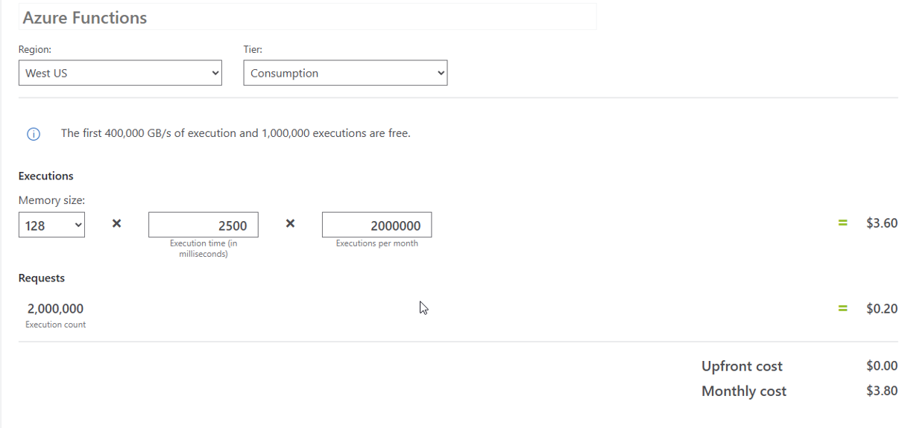
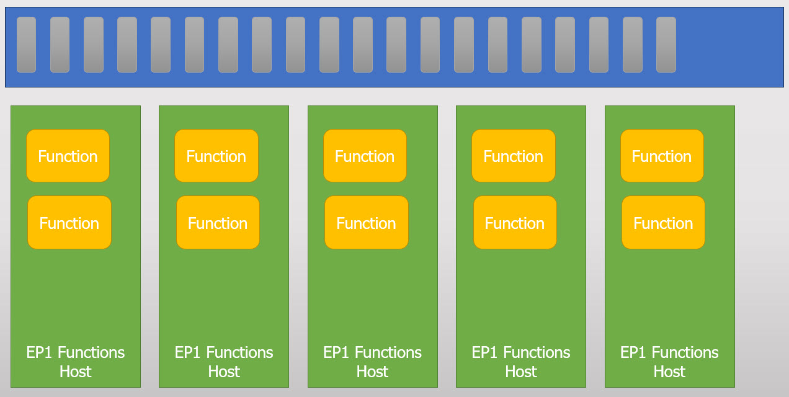
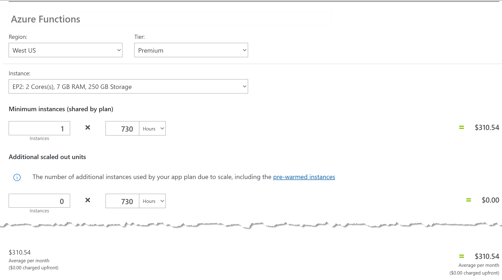
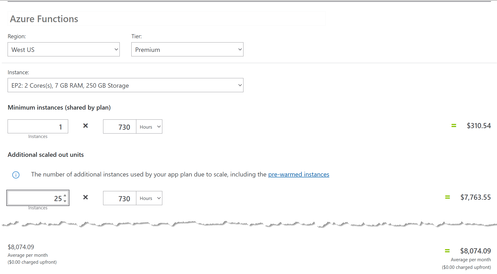

> This article is my entry to C# Advent 2024. Please visit [C# Advent](https://www.csadvent.christmas/) to see all the other great articles!

Hello 👋, I'm Kevin, a member of a very exclusive club.  

I'm a member of the "Accidentally Spent a Lot of Money on Cloud" club.  We have a special handshake, too; it looks like this:

I want to discuss one of the cases where we made this mistake, how it was made, and how I could have avoided it.

## The Setup

I need to declare here at the start that I love serverless. Because of my severe Azure bias, I will talk strictly about Azure Functions. But as far as I'm aware, the big mistake I made with Azure Functions is a mistake that can happen on any cloud provider.

Doing different types of work in the background is imperative to any growing software application.  

Sending transactional emails, charging credit cards, processing complex data, etc., are all typically done best in the background of an application, ideally in a location that does not impact the user experience.

I've discussed many ways to solve this as a .NET developer.  

One of my favorite solutions has been to embrace Azure Functions.

## Why Serverless?

I have a handful of reasons I love using Azure Function.

### Cheap cheap cheap

It’s ridiculously affordable when running on the Consumption plan. You’re literally paying pennies for your functions to run. Not nickels. Not dimes. Pennies.

For example, imagine you’re running thousands of operations daily. On a Consumption plan, your Azure Functions will execute like a magician pulling rabbits out of hats—without needing you to pull cash out of your wallet. If you’re bootstrapping or working on a side hustle, this kind of pricing is your BFF. And let’s be honest, we all love a good deal—especially one that doesn’t make us sell a kidney to keep the lights on.

### You Don't Want Application Host Ceremony

When deploying applications, eliminating the unnecessary overhead known as "application host ceremony" is paramount. This refers to the time and resources traditionally spent on server setups, environment configurations, and dependency management. By adopting  Azure Functions, you can significantly cut down on this ceremony. This shift lets your development team concentrate on writing and deploying code instead of juggling infrastructural challenges. With the complexities of server management abstracted away, you can innovate faster, deploy features more frequently, and enhance overall productivity. Reducing the host ceremony leads to a more streamlined development process, enabling you to deliver valuable functionalities to users swiftly and efficiently.

### Burstable Scale  

Burstable scale is a game-changer for managing cloud resources, allowing services to adapt dynamically to sudden spikes in demand. Azure Functions illustrates this brilliantly by automatically scaling resources in response to incoming requests or queued messages. Azure Functions can effortlessly spin up additional instances to handle concurrent tasks during peak times, ensuring that workloads are processed without delays or failures. This elasticity is invaluable for applications experiencing fluctuating traffic, offering cost savings by utilizing resources only when necessary. By leveraging burstable scale, developers can create robust, responsive applications capable of adapting to varying loads, ultimately leading to enhanced user experiences and greater operational efficiency.

## Using the System As Designed

One of the applications we moved to Azure Functions had a simple queue, and we followed the "Producer/Consumer" pattern to get work done as quickly as possible.

In the Producer/Consumer model, a Trigger (in this case, a Timer Trigger) generates all the needed work and puts it into a queue. Another function (a Queue Trigger) grabs items from the queue and processes them.

As the queue's back pressure intensifies, Azure Functions automatically starts new instances of the Functions host. These additional hosts pick up more items off the queue. This process continues until the queue is cleared or the maximum number of instances is created.

This process is "cloud scale" in the best form of the phrase. In my talk, "Annihilating Workloads with Azure Functions," I cover this concept. Azure Functions wants to get your work done as quickly as possible and will scale to get the job done. It's freakin' cool to watch.

## Azure Function Limitations

An Azure Function "instance" is limited. We've hit limits with memory and hard drive space. When these limitations occur, the alternative is to upgrade to an "Elastic Premium" offering. It's still consumption-based pricing, but it's a beefier machine for you to use.

## Burstable Elastic Premium is MONEY

We've determined two things: cloud scale in bursts is incredible, and using a larger instance when needed is useful.

But what happens when you combine the two? For us, using elastic premium for prolonged Azure Function instances was a mistake. The back pressure of our queues was never-ending, so Azure would naturally ramp up all the resources I told it to. This eventually would stop at the limit of the Functions, which is 25 instances by default.

If one elastic monthly premium is expensive, then 25 is another level!

## Conclusion

I think Serverless is an amazing solution and viable for a multitude of problems. However, I recommend you avoid the "everything is a nail" problem.  

After seeing this mistake in production, we took steps to move many of our memory-intensive jobs to Azure Container Apps. We still have the flexibility for scaling, but the resources for one particular container are greater than what we were seeing with Azure Functions.

Of course, other ways exist to solve this problem, and I'd love to hear your thoughts. Let's continue this conversation on [X](https://x.com/1kevgriff), [BlueSky](https://bsky.app/profile/consultwithgriff.com), or [LinkedIn](https://www.linkedin.com/in/1kevgriff/).
