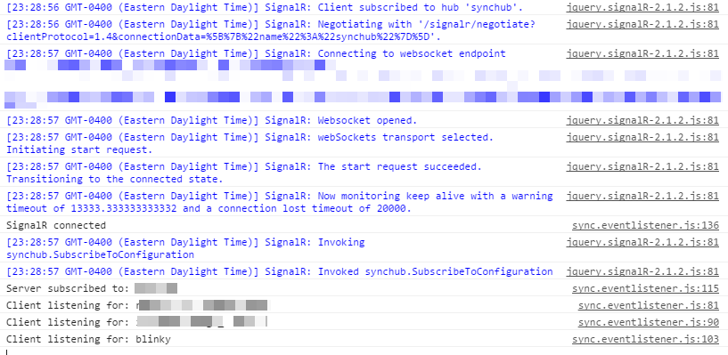

It is easy to think that SignalR works within a black box, but if you are deploying JavaScript clients, here is an EASY trick to learning what is happening underneath the scenes.

Before you start your connection, add this ONE line of code:

```javascript
$.connection.hub.logging = true;
$.connection.hub.start();
```

Tada!  You have logging in your browser console:

