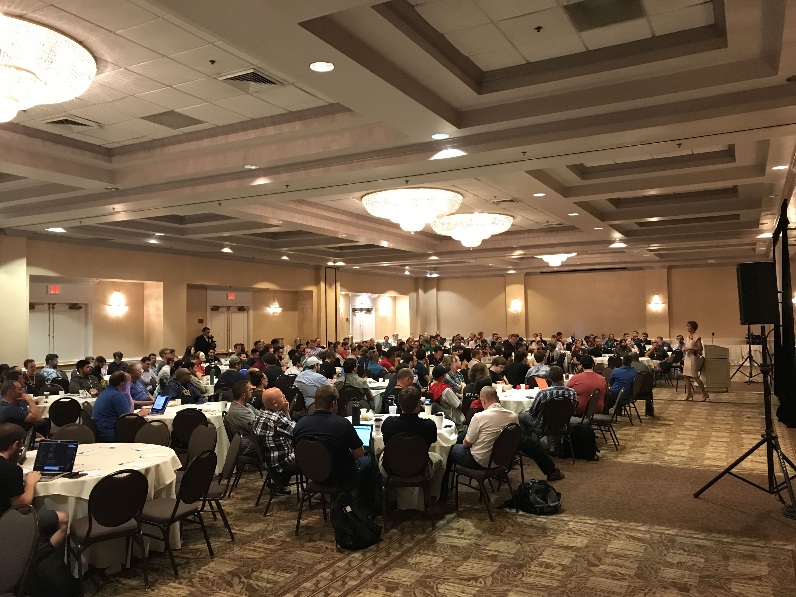
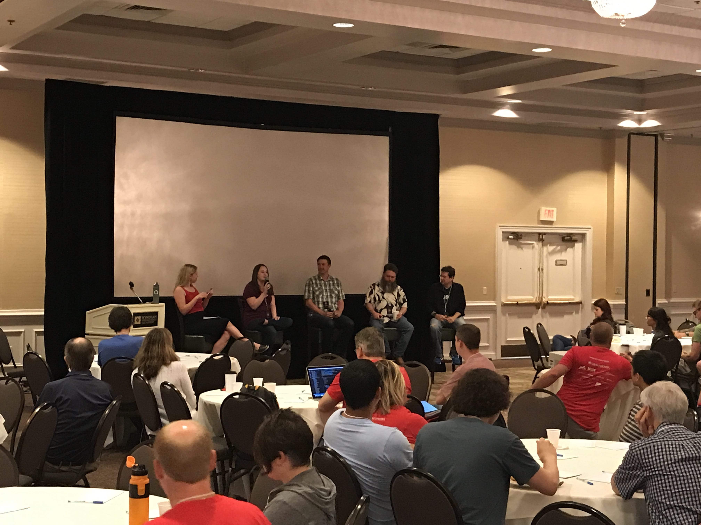

On June 1st and 2nd, 2017, a crew of over 300 people embarked on Virginia Beach, VA for the 2nd ever RevolutionConf.

I am one of the primary organizers of RevolutionConf - partnered with my good friends [Linda Nichols](https://twitter.com/lynnaloo) and [Erik Olson](https://twitter.com/erikpmp).  We also have an amazing board of advisors: [Alex Proaps](https://twitter.com/alexproaps), [Ken Taylor](https://twitter.com/taylorka), and [Adam Sterrett](https://twitter.com/tealmage).

This conference is one of the crowning acheivements of my career.  I do not believe I can describe in words the feeling that comes when professionals from ALL OVER THE WORLD unite to do something awesome.

RevolutionConf is a "technology agnostic" conference.  What does that mean?  

**You are not defined by your stack.**  
If you sling code, or want to sling code, we love you and you are a respected member of this community.

**You have skills and stories that others could benefit from.**  
Learning how to solve a problem in another programming language or framework can greatly benefit how you solve problems in your daily language of choice.  Or you might learn that something that would take you 10 hours to build in Java only take 10 minutes in Python.  

**Every session needs something for everyone**  
This is the hardest thing to do.  We urged our speakers to consider topics that would apply to anyone that walked in the door.  Even though a topic might be on "Azure" - it shouldn't require five years of Azure experience to understand.  

## Not Your Common Event Recap
This recap is meant to give you an "insider" view of what went right and what could've been better about RevolutionConf.  I'm a huge advocate about learning in public - so here we go!

## What went right

**New Venue**  
RevolutionConf 2016 was *designed* to fit 250 people into a space that would've been better for 200.  We wanted event spaces to feel "full".  This helped create the sense of popularity and was a huge help when pushing people to buy tickets in 2017.

For RevolutionConf to grow, we needed a bigger venue.  Not just bigger, but something we could grow into more comfortably.  

Choosing a venue is one of the most difficult decisions you can make.  A bad venue can really *break* your event.  For 2017, we chose the Wyndham Virginia Beach in Virginia Beach, VA.  

Three major reasons for this venue:  
1. It was on the beach.  Our out of town attendees and speakers appreciated our closeness to the beach.  The team decided this had to be a continuing trend.  RevolutionConf would be a destination conference.  The type of place you bring your family to or take an extended vacation.
2. It could eventually hold 500 people.  Looking at raw room sizes, 500 people was the largest we could comfortably go.  We wanted RevolutionConf to grow in 2017, but we didn't want to spend a major amount of our time in 2018 searching for a new venue.  We need space to grow.
3. It didn't cost an arm and a leg.  Venues are relatively cheap.  Our entire venue was *free*.  However, you will get nailed with food and beverage minimums.  One day I'll write about the RevolutionConf budget, but I'll just say for now that the F&B costs tripled from 2016 to 2017 and we only grew by about 100 attendees.

> EDIT: My co-organizer Erik brought up an excellent point that I didn't mention - minimums weren't our problem.  Per customer pricing for food was.  We only had at $20,000 minimum but our actual costs were well over $35,000.  We were lured in by lower minimums and shocked by actual costs.  This subject alone merits its own post.

**A System For Everything and a Fantastic Team**  
Our team consists of experienced event runners.  Part of what makes RevolutionConf happen so smoothly is that everyone has a job, and we're consistently checking in on each other.

Since this is not our first event, we already had systems in place for several critical event tasks:

* Ticket registration
* Sponsorships
* Call of Papers
* Badges
* Printables (posters, schedules, etc)
* T-Shirts

**Our Volunteers**  
There is a lot of extra work that needs to be done around the conference.  Registration, passing out badges and t-shirts, making sure people know where lunch is, ensure that sessions start on time, getting A/V if something is wonky, etc etc.

This year, we implemented a Call for Volunteers.  People could submit as to "why" they wanted volunteer at RevolutionConf (in exchange for a free ticket).

Our volunteers were AMAZING.  We originally set up times for the volunteers to be "on", but all of them went above and beyond.

**Scholarships**  
Diversity is important to us.  But it really does cost money to send someone through RevolutionConf.  When the conference budget is tight to begin with, we needed to be creative in how we could make RevolutionConf accessible to everyone.  I believe our approach paid DIVIDENDS.

First, every person that bought a ticket was given the option to donate money to our scholarship fund.  The average donation was $50.  This makes sense because that was the default value we set.  Next year, we'll bump that a bit.

Second, we had budget for speaker travel and expenses.  Our social agreement with speakers was that if they chose to not use the travel budget (meaning they cover the costs of getting here), we would put that money towards scholarships.  Our speakers LOVED this idea, and many who had corporate backing gladly gave up their T&E.

I can safely say we gave away 20 scholarships to RevolutionConf.  Boom.

**Our A/V Team**  
For technical events, having a good audio/video team is essential for success.  We lucked out by hiring [Elite Presentations](http://eliteavelements.com/).  This team was as professional as you could get, and we did not have a single A/V problem they were not prepared for.

**Luau**  
Every great event needs to have a dedicated networking time.  This year, we started the tradition of the RevolutionConf Luau.  HOLY CRAP this was a fun time.

Here is a drone overview of the event as it was kicking off.

`youtube:https://www.youtube.com/embed/Ds27K9yYWCM`

## What could've been better

**Internet Access**  
I know, I know.  DUH, Kevin.  We warned the venue beforehand that we were probably going to break the internet.

> We should be fine!  Larger groups than your have been in here, and they had no problems.

And guess what?  Internet broke about an hour into day 1.  Our venue was amazing though and had everything working better before lunchtime.  We were already prepared though, and had dedicated hotspots available for the speakers to use.  However, this really affected our workshops the most, because they depended on internet.  

If you're running an event and need to explain why tech conferences break internet, here is a simple explaination without being geeky.

>The problem is rarely bandwidth.  Yes - speed is an issue, but the primarly reason we've seen internet stop working at conferences is the lack of IP addresses.
>
>An IP address being a unique address for a resource on the network.  Our conference center was configured to give out ~500 IP addresses.  
>
>Every attendee has between 1 and 3 PHYSICAL devices.  Laptops, phones, and tablets.  Some folks, when they open their laptops, also have virtual machines that require an IP address.  That means that any ONE person could require multiple IP addresses.  Multiply that by 350 and *boom* you've broke the internet.

The venue has already announced plans to upgrade their internet - but we've taking additional precautions.  For next year, we've already warned our amazing A/V team to prepare for mesh wireless networks.  

**Students**  
Being a student is hard, especially if you don't quality for our diveristy scholarship.  To combat this, we provided stupid-cheap discount tickets - easily 50% less than the lowest cost to the public.  We sold maybe 2 student tickets.

I'd like to think the diversity scholarship picked up most of the students that wanted to come - but I have another theory.

Students don't see the value in events like this.  Because why would you want to spend two days in a conference center surrounded by people hiring for jobs and looking for dedicated folks.  /sarcasm

Next year, we need to figure out a better way to promote WHY RevolutionConf is good for students.  

**Hotels can't hotel**  
This really seems like a recurrning issues.  Hotels are pretty bad at *being hotels*.  RevolutionConf had a block price for rooms - pretty dang good if you consider it is after Memorial Day and ON THE BEACH.  In order to support this price, we had to promise the hotel we would book a certain number of nights.

The *easiest* way to prevent having to pay the hotel for failure to commit is that we pick up the rooms for all our speakers (and core organizers).  RevolutionConf had 50 speakers, and most of them needed a room.  Covered.  Good to go!

Let's say you were an attendee needing a room.  You know there is a "RevolutionConf" rate.  Very few hotels have online booking for room blocks.  None of the venues we talked to supported that option - you have to call in to get the rate.

No big deal, right?  If you called the national reservation line, they had NO idea what our conference was.  Several people asked us *how* to get the rate, and we thought "call the hotel" was good enough.  We ended up having to direct people to the local hotel number in order to get the good rate.

I don't know if there is a better way to deal with this issue, other than to just anticipate it.

**VIP Dinner**  
Attendees would have never noticed this - but we have a special event the night before the conference where we invite our speakers and volunteers to gather and meet each other. 

This event is nowhere near the conference hotel, and we provide food and beverages to everyone.

As the organizers of the conference, we want people to be safe first.  That means controlling the means of getting people to and from the party.

Our plan was to rent/borrow the hotel shuttle to get everyone there safely.  In fact, the hotel told us this was cool.  Come to discover the week leading up to the event, we would have to pay $50 each way for the shuttle (which only holds up to 8 people).  To transport ~50 people would require a lot of TIME and money that we didn't plan for properly.

To accomodate the safety of our "VIPs", three of us deployed Lyft and Uber to call and reserve cars for our guests.  Within about 20-30 minutes, everyone was safely at the dinner venue.

Next year, we plan to rent a party bus or trolley (this IS Virginia Beach, afterall) to take everyone where they need to go.  Now we know :)

## Kicking off next year
RevolutionConf 2018 *is going to happen*.  The team is taking a well deserved break, and then we are pushing forward on planning this event.

If you'd like to keep up to date with us: Follow us on [Twitter](https://twitter.com/revconf) or [Facebook](https://facebook.com/revconf).